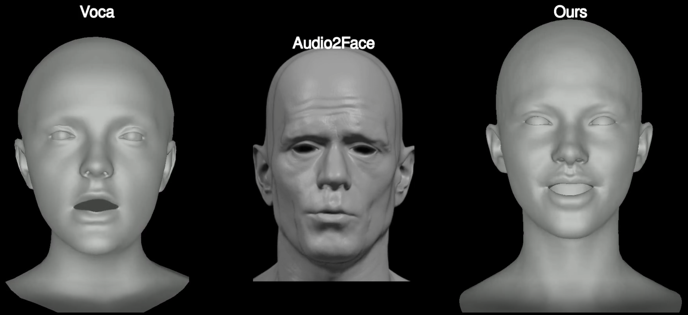

This project provides a fast and efficient way to create side-by-side or grid view demo videos for comparing the differences between various models and methods. It uses a configuration file to specify the properties of each video clip, such as cropping, zooming, adding captions, and more.



## Installation

This project is tested on Python 3.9. You can install the required packages using pip:

```bash
pip install -r requirements.txt
```

## Usage

To use this tool, you need to pass the path of the configuration file and the output path as command-line arguments:

```bash
python main.py config_path output_path
```

## Configuration File

The configuration file is a JSON file that contains the configuration for the video. The configuration specifies the properties of a video clip.

Here is an example of a configuration file:

```json
{
    "function": "makeColView",
    "argument": [
        {
            "function": "readVideoFile",
            "argument": "../sample2.mp4",
            "adjust": {
                "crop": [ 316, 0, 760, 640 ],
                "zoom": 1.6,
                "subclip": [ 5.05, 10 ],
                "mute": true
            }
        },
        {
            "function": "readVideoFile",
            "argument": "../sample.mp4",
            "adjust": {
                "caption": "sample2.mp4"
            }
        }
    ]
}
```

The tool will process each video according to its configuration, and then arrange them side by side or in a grid to create the final video.

Each object can have the following properties:

- ``function``: The function to be called. It can be makeColView for side-by-side view or makeGridView for grid view.
- ``argument``: The argument to be passed to the function. It can be a list of video configurations for makeColView or a 2D list of video configurations for makeGridView.
- ``adjust``: The adjustments to be made to the video. It can include crop, zoom, subclip, mute, and caption.


``adjust`` can have the following properties:

- ``path``: The path to the video file.
- ``caption``: The caption to be displayed on the video.
- ``crop``: The coordinates to crop the video. It should be an array of four integers: ``[x1, y1, x2, y2]``.
- ``zoom``: The zoom factor. The video will be zoomed in by this factor.
- ``subclip``: The time range in seconds to extract a subclip from the video. It should be an array of two floats: ``[start_time, end_time]``.
- ``mute``: A boolean value that indicates whether to mute the audio of the video.

Here is another example:

```json
{
    "function": "makeGrid2D",
    "argument": [
        [
            {
                "function": "readVideoFile",
                "argument": "../sample.mp4"
            },
            {
                "function": "readVideoFile",
                "argument": "../sample.mp4"
            }
        ],
        [
            {
                "function": "readVideoFile",
                "argument": "../sample.mp4"
            },
            {
                "function": "readVideoFile",
                "argument": "../sample.mp4"
            }
        ]
    ]
}
```